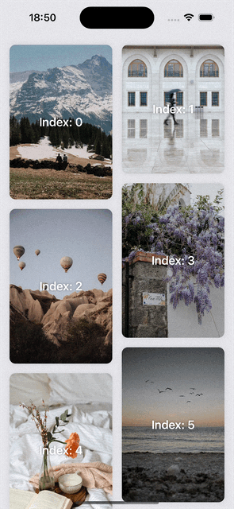

# PinterestLikeGrid

An easy way to create beautiful grid views on SwiftUI :) 

This component allows you to split an array into any number of columns while still handling the original array with the correct indexes.


## Installation

#### Swift Package Manager
1. In Xcode, select File > Swift Packages > Add Package Dependency.
2. Enter `https://github.com/thaisrfernandes/PinterestLikeGrid.git`
3. Follow the prompts to select the version or branch to use.


## Usage

The component requires an array of hashable items to be displayed, the number of columns to be used, and a closure to represent each item in the grid.

Here's an example of how to use it:

```swift
struct ContentView: View {
    @State var data = [1, 2, 3, 4]
    
    var body: some View {
        PinterestLikeGrid($data, columns: 3, spacing: 8) { item, index in
            Text("\(item)")

            if let index = index {
                Text("Index: \(index)")
            }
        }
    }
}
```

### Parameters

| Parameter   | Type       | Description                           |
| :---------- | :--------- | :---------------------------------- |
| `data` | `Binding<Array<T>>` | Binding array of hashable items to be displayed on the grid |
| `columns` | `Int` | _(Optional)_ Number of columns to display grid. The default is 2.  |
| `columnSpacing` | `CGFloat` | _(Optional)_ Number of spacing between columns. The default is 8.  |
| `rowSpacing` | `CGFloat` | _(Optional)_ Number of spacing between rows. The default is 8.  |
| `spacing` | `CGFloat` | _(Optional)_ Number of spacing between rows and columns. The default is 8.  |
| `content` | `(_ item: T, _ index: Int) -> View` | Closure that receives an item and an index that must return a view to represent each item in the grid |


#### Basic Init

```swift
PinterestLikeGrid($data) { item, index in
    ...
}
```

#### Number of Columns

```swift
PinterestLikeGrid($data, columns: 3) { item, index in
    ...
}
```

#### Items Spacing

```swift
PinterestLikeGrid($data, spacing: 12) { item, index in
    ...
}
```

#### Items Vertical Spacing

```swift
PinterestLikeGrid($data, columns: 3, rowSpacing: 6) { item, index in
    ...
}
```

#### Items Horizontal Spacing

```swift
PinterestLikeGrid($data, columnSpacing: 3) { item, index in
    ...
}
```


## Implementation details

PinterestLikeGrid uses a helper method called `splitData` to split the data array into the specified number of columns. The method returns an array of arrays of hashable items.

Then, it uses a `HStack` to display the columns and a `VStack` to display the items in each column. It also uses the `matchedGeometryEffect` modifier to provide a nice animation effect when the items are added or removed from the grid.

`getIndexInList(for:)` is a helper method that returns the index of a specified item from the data array.


## References

This component was heavily inspired by these two tutorials that I am specially thankful for:

[Kavsoft - SwiftUI 3.0: Staggered Grid With Matched Geometry Effect - Xcode 13 - WWDC 2021](https://www.youtube.com/watch?v=VrwINubmq5g)

[Haipp - How To Create a PINTEREST GRID in SwiftUI (EASY WAY)](https://www.youtube.com/watch?v=TvkmI4CXsh0)

[xavier7t - Grid View in SwiftUI](https://xavier7t.com/grid-view-in-swiftui)
